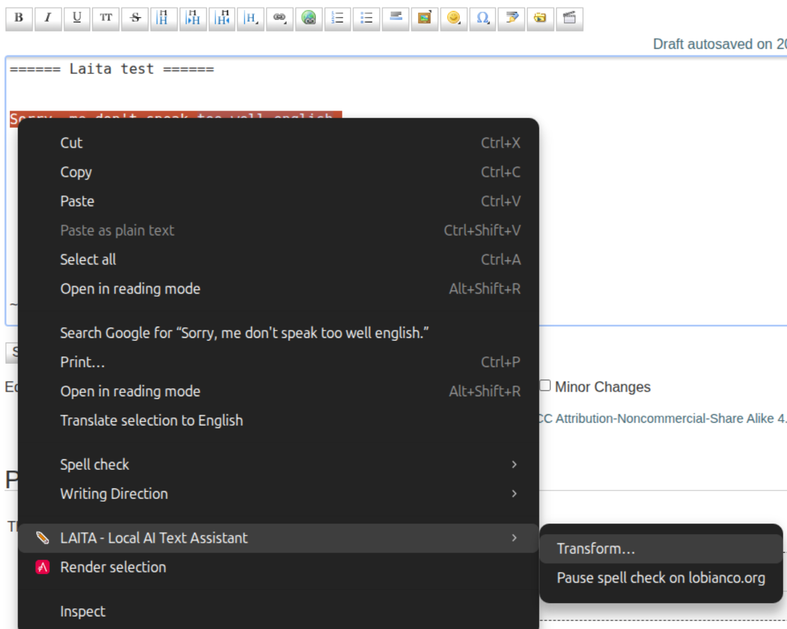
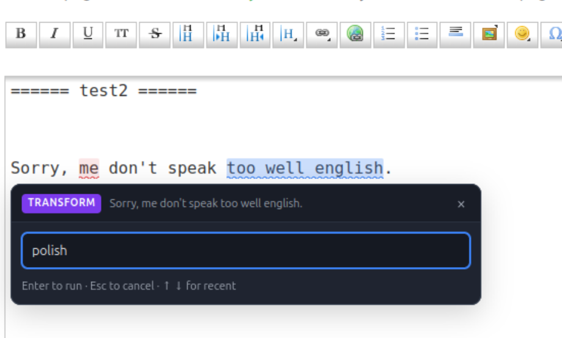

# Local AI Text Assistant

A Firefox extension that **proofreads what you type** into any web form and **rewrites
text you select**, using a model running locally on your machine (via [Ollama](https://ollama.com)).

It works like [Harper](https://writewithharper.com/) or LanguageTool, but the judgement
comes from an LLM rather than hand-written rules, so it handles style and phrasing as well
as hard grammar errors, and it works in any language the model knows.

**Nothing leaves your machine.** The only network destination is your own Ollama endpoint.

---

## 1. What it does

### Catches mistakes as you type

Problems get a coloured wavy underline. Click one for the explanation and the fix.


Three kinds of problem, each with its own colour:

| Colour | Category | What it means |
| --- | --- | --- |
| 🔴 red | **error** | Objectively wrong: spelling, agreement, conjugation, punctuation, wrong preposition. |
| 🟡 yellow | **style** | Not wrong, but weak: wordiness, redundancy, needless passive, repetition. |
| 🔵 blue | **rephrase** | A better word or a more natural formulation. |


Each card offers **Apply**, **Dismiss**, **Never suggest** — and **Add to dictionary** when
the text is a single word.

### Rewrites a selection however you ask

Select text, right-click, and pick **Transform…**:



Type what you want done with it. Press Enter on an empty box for the default, `polish`:



The result can replace the selection, be inserted after it, or be thrown away:


`translate to French`, `shorten it`, `make it more formal`, `turn into bullet points` — the
instruction is free text, so anything the model understands works.

The language of each field is detected automatically (English and French are the tuned
cases; Italian, Spanish, German, Portuguese and Dutch are also recognised), or you can pin
one language in the options.

---

## 2. Requirements

- **Firefox 142** or newer
- **[Ollama](https://ollama.com)** running locally, with a model pulled:
  ```bash
  ollama pull qwen3.5:9b
  ```

A 7–9B instruction model is the sweet spot. `qwen3.5:9b` was used to develop this and gives
good results in both English and French. Smaller models are faster but miss more and invent
more; `qwen3.5:4b` is a reasonable choice on a GPU with less than 8 GB.

**A paragraph takes a few seconds** on a mid-range GPU. That is why the extension checks
only the paragraph you are working in, caches every result, and re-sends only what you
changed. If it feels much slower than that, something is wrong outside the extension —
see [everything is slow](#everything-is-slow), which on a laptop is usually the power
profile.

---

## 3. Install

### Step 1 — let Ollama accept requests from the extension  ⚠️ required

Ollama refuses requests whose `Origin` is a browser extension unless you allow it.
Firefox **does** send `Origin: moz-extension://…`, so without this step every check fails.

You need to set the environment variable `OLLAMA_ORIGINS` to `moz-extension://*` **for the
Ollama server process**, then restart Ollama. How you do that depends on the platform.

<details open>
<summary><b>Linux</b> (systemd — the only platform this has been tested on)</summary>

```bash
sudo mkdir -p /etc/systemd/system/ollama.service.d
printf '[Service]\nEnvironment="OLLAMA_ORIGINS=moz-extension://*"\n' \
  | sudo tee /etc/systemd/system/ollama.service.d/locaispell.conf
sudo systemctl daemon-reload && sudo systemctl restart ollama
```

A *drop-in* is a small file that adds settings to a service without editing the file the
package manager owns. Verify it took effect:

```bash
systemctl show ollama -p Environment | tr ' ' '\n' | grep ORIGINS
```
</details>

<details>
<summary><b>macOS</b> (not tested — please report whether it works)</summary>

For the menu-bar app, set the variable for your login session and restart Ollama:

```bash
launchctl setenv OLLAMA_ORIGINS "moz-extension://*"
```

Then quit Ollama from the menu bar and start it again. `launchctl setenv` does not survive
a reboot; to make it permanent, add it to a LaunchAgent.

If you run `ollama serve` yourself from a terminal instead, just export the variable in
that shell:

```bash
export OLLAMA_ORIGINS="moz-extension://*"
ollama serve
```
</details>

<details>
<summary><b>Windows</b> (not tested — please report whether it works)</summary>

Ollama reads user environment variables at startup.

1. Quit Ollama from the system tray.
2. Press `Win`, type *environment variables*, open **Edit the system environment
   variables** → **Environment Variables…**
3. Under **User variables**, add `OLLAMA_ORIGINS` with the value `moz-extension://*`
4. Start Ollama again.

Or from PowerShell, then restart Ollama:

```powershell
setx OLLAMA_ORIGINS "moz-extension://*"
```
</details>

> **Only the Linux instructions above have been tested.** The macOS and Windows steps
> follow Ollama's documented behaviour but have not been verified on those platforms. If
> you try one, [an issue](https://github.com/sylvaticus/locaispell/issues) saying whether
> it worked would be welcome.

Whatever your platform, this check should return something other than `403`:

```bash
curl -s -o /dev/null -w '%{http_code}\n' -X POST \
  -H "Origin: moz-extension://11111111-2222-3333-4444-555555555555" \
  -H "Content-Type: application/json" -d '{"model":"qwen3.5:9b"}' \
  http://localhost:11434/api/show
```

`200` means you are set. `403` means Ollama did not pick up the variable — it almost always
means Ollama was not restarted.

### Step 2 — install the extension

**From Firefox Add-ons** — the normal way, and it updates itself:

> **[Local AI Text Assistant on addons.mozilla.org](https://addons.mozilla.org/firefox/addon/local-ai-text-assistant/)**
>
> The listing is awaiting Mozilla's review. Until it is approved that link will not
> resolve — use the direct download below in the meantime.

**Or install the signed file directly**, which works today and needs no listing:

1. Download the latest `.xpi` from the
   [releases page](https://github.com/sylvaticus/locaispell/releases).
2. Open `about:addons`
3. Click the **gear icon** → **Install Add-on From File…**
4. Choose the `.xpi` you downloaded

Either way the file is signed by Mozilla, so it installs permanently and survives
restarts. The options page opens the first time. The one difference is updates: a copy
installed from the directory updates itself, a `.xpi` installed by hand does not, so you
would download a newer one when you want it.

> Building it yourself, or working on the code? See
> [`doc/dev_doc.md`](doc/dev_doc.md) — a development build loads straight from
> `manifest.json` via `about:debugging`, with no signing.

### Step 3 — check the connection

On the options page press **Test connection**. You should see
*"Connected. N models available, "qwen3.5:9b" is one of them."*

That test deliberately performs a `POST`, because a plain `GET` carries no `Origin` header
and would report success even while real checks were being refused.

---

## 4. Using it

Click into any text box and type. Roughly 1.5 seconds after you stop, **the paragraph you
are working in** is checked and problems get a coloured wavy underline. Paragraphs you
visit later are checked as you reach them, and each one keeps its highlights once found —
so opening a long post does not set off a request per paragraph before you have typed
anything. Press **Alt+Shift+C** to check the whole field at once, or change *How much to
check* in the options. A small translucent pill just below the field
shows progress; click its **×** to hide it and abandon the check that is running.

- **Click a highlight** to open a card with the explanation and the suggested text.
  - **Apply** — replaces just that span. Your undo history (`Ctrl+Z`) still works.
  - **Dismiss** — hides this one for now.
  - **Never suggest** — remembers the suggestion and never offers it again.
  - **Add to dictionary** — for a single word, adds it to your personal dictionary.
- **Alt+Shift+C** — check the focused field immediately.
- **Alt+Shift+X** — pause (or resume) proofreading on the current site. The same thing is
  in the right-click menu as **Locaispell: pause / resume spell check on …**, and on the
  toolbar button. See [pausing on a site](#pausing-on-a-site).
- The **toolbar button** shows the issue count, the connection status, and per-site and
  global on/off switches.

Both plain `<textarea>` / `<input>` fields and rich `contenteditable` editors (webmail,
wikis, most WYSIWYG editors) are supported.

### Transforming a selection

Proofreading suggests small fixes and never rewrites wholesale. When you *want* a rewrite,
select the text, right-click and choose **Local AI Text Assistant → Transform…** (or press
**Alt+Shift+T**).

A one-line box opens. Type what you want done and press Enter:

| You type | You get |
| --- | --- |
| *(nothing)* | the default instruction, `polish` — change it in the options |
| `translate to French` | the same passage in French |
| `shorten it` | a tighter version |
| `make it more formal` | register changed, meaning kept |
| `turn into bullet points` | the passage restructured |

`↑` and `↓` recall your recent instructions. `Esc` cancels — including while the model is
still working, which aborts the request.

The result appears in a panel with three choices:

- **Accept & replace** — the selection becomes the new text. This is the default: the
  button already has focus, so Enter takes it.
- **Reject** — nothing changes.
- **Accept & append** — the new text is inserted *after* the selection, which keeps the
  original. A space is added between them, or a blank line if either side spans more than
  one line.

`Ctrl+Z` undoes an accepted transform like any other edit.

Selecting text that is **not** in an editable field still works — a paragraph of an
article, say — but since there is nothing to replace, the panel offers **Copy** instead.

Two things worth knowing:

- The instruction is free text sent to the model as-is, so anything the model understands
  works. The prompt forbids commentary, so you get the rewritten passage and nothing else.
- Unlike proofreading, a transform is never automatic and ignores the per-site switch: you
  asked for it explicitly, so it runs wherever you ask for it.

### Pausing on a site

Three places do the same thing — the right-click menu, **Alt+Shift+X**, and the toolbar
button's per-site switch. The menu entry names the site and says which way it will go, so
you can see the current state before clicking:

> Locaispell: pause spell check on **news.ycombinator.com**

A pause set this way is an **override**: it wins over the allowlist/denylist in the
options, so it holds whatever the standing policy says for that hostname. It applies to
that exact hostname, not its subdomains, and it survives a restart until you lift it —
either by resuming from the same menu, or with **Clear per-site pauses** under
*Maintenance* in the options.

Resuming a site while the extension is switched off globally turns the global switch back
on too, since otherwise "resume" would appear to do nothing.

Pausing only stops the automatic proofreading. **Local AI Text Assistant → Transform…** is something you
ask for explicitly, so it keeps working on a paused site.

### What Local AI Text Assistant will not touch

Passwords, payment fields, one-time codes, and any field whose type, `autocomplete`, name,
id, placeholder or class hints at a secret are skipped outright — they are never read and
never sent anywhere. Fields shorter than 12 characters are ignored too.

To exclude anything else, add `data-locaispell="off"` to it or to any ancestor.

---

## 5. Options

Open them from the toolbar popup, or from `about:addons` → Local AI Text Assistant → Preferences.

| Setting | Default | Notes |
| --- | --- | --- |
| Ollama endpoint | `http://localhost:11434` | |
| Model | `qwen3.5:9b` | The field autocompletes from your installed models. |
| Temperature | `0` | Keep at 0 for repeatable corrections. |
| Context window (tokens) | `0` | `0` follows Ollama's own setting. Pinning a different number makes Ollama unload another app's model and load a second copy of the same weights. See [sharing Ollama](#sharing-ollama-with-other-apps). |
| Parallel requests | `1` | Raise only if you have set `OLLAMA_NUM_PARALLEL` higher. Ollama serves one request at a time by default, so extra ones just queue — and a queued request's timeout is already running. |
| Keep model loaded for | `10m` | Avoids a slow reload on every check. Needs a unit (`30m`, `8h`); `-1m` — or any negative value — keeps it loaded indefinitely, while a bare `-1` is rejected by Ollama. Sent with every request, so it overrides the server's `OLLAMA_KEEP_ALIVE`. |
| Allow the model to "think" | off | Reasoning traces make checks several times slower. |
| Trigger | automatic | Or manual only, via `Alt+Shift+C`. |
| How much to check | the paragraph I am working in | `The whole field` checks every paragraph as soon as you focus it — one request each, which is slow on a long document. `Alt+Shift+C` and the toolbar button sweep everything either way. |
| Typing pause | `1500 ms` | |
| Ignore fields shorter than | `12` characters | |
| Maximum chunk size | `700` characters | Longer paragraphs are split on sentence boundaries. |
| Language | detect | Or pin one. |
| Categories and colours | all on | Turn off a category to stop paying for it. |
| House style rules | empty | Free text appended to the prompt, e.g. *"Prefer British spelling."* |
| Personal dictionary | empty | One word per line, never flagged. |
| Sites | run everywhere | Or switch to an allowlist. A per-site pause overrides this. |
| Default transform instruction | `polish` | What an empty transform prompt means. |
| Recent instructions | empty | The ↑/↓ history in the transform box; editable here. |

---

## 6. Troubleshooting

| Symptom | Cause and fix |
| --- | --- |
| *"Ollama refused the request because it came from a browser extension"* | Step 1 was skipped, or Ollama was not restarted after it. |
| *"Cannot reach Ollama"* | `ollama serve` is not running, or the endpoint is wrong. Try `curl http://localhost:11434/api/tags`. |
| *"Ollama does not have that model"* | `ollama pull <model>`. |
| *"The request to Ollama timed out"* | The model is slow to load, or too large for the machine. Raise the timeout, or use a smaller model. |
| *"Ollama could not start the model"* | The model does not fit in the GPU next to whatever else is using it. See [errors that come and go](#errors-that-come-and-go). |
| *"was reloaded or updated, so this page is still running the old copy"* | Exactly that: reload the page. Pages open while you reload the extension in `about:debugging` keep the old content scripts, which can no longer reach it. |
| *"the background page did not answer"* | Firefox unloaded the extension's background page. Long requests hold it open, so if you see this, reload the tab and report it. |
| Nothing happens at all | The site may be disabled (check the toolbar popup), the field may be too short, or it may look like a password field. |
| Highlights sit slightly off | Report it — the field probably uses a layout the mirror does not yet copy. |
| Checks feel slow | **Check your laptop's power profile first** — see [everything is slow](#everything-is-slow). Otherwise: lower *maximum chunk size*, turn off the *rephrase* category, or use a smaller model. The first check after an idle period also pays for reloading the model. |

### Everything is slow

On a laptop, check the power profile before anything else. Measured on one machine with
an RTX 2000 Ada, the same model and the same 149-word request:

| Profile | GPU clock under load | Power | Generation | Request |
| --- | --- | --- | --- | --- |
| `power-saver` | 210 MHz | 1.9 W | 1.8 tok/s | 86 s |
| `balanced` | 480–615 MHz | 30 W | 20.1 tok/s | 8.2 s |
| `performance` | 930–1155 MHz | 35 W | 30.2 tok/s | 5.3 s |

Seventeen times, from one setting. `power-saver` pins the dGPU to its floor even on mains
power, and the symptom is not "a bit slow" — it is checks that run for a minute and time
out, which looks like a broken extension.

```bash
powerprofilesctl get                 # what you are on
powerprofilesctl set performance
nvidia-smi --query-gpu=utilization.gpu,clocks.sm,power.draw --format=csv -l 1
```

Run that last one *while a check is happening*. At idle every GPU sits at its floor, so an
idle reading tells you nothing. If the clock stays near the floor at 100% utilisation, the
GPU is being clamped. `nvidia-smi -q -d PERFORMANCE` names the reason; `SW Power Cap`
while power draw sits exactly at the limit is normal and just means the card is at its
designed TGP.

Anything else competing for the machine matters too, because a laptop shares a power and
thermal budget between CPU and GPU. A runaway process pinning a couple of cores costs GPU
clocks directly.

Rough guide once the GPU is running properly: **a paragraph is a few seconds.** If a
paragraph takes half a minute, something is wrong outside the extension.

### Sharing Ollama with other apps

Ollama identifies a loaded model by its weights **and its runtime options**. Ask for the
same model with a different `num_ctx` and it does not reuse what is resident: it unloads
that runner and starts a second one. On a machine where the model only just fits, that
unload-and-reload is where load failures come from.

So if you also use Open WebUI, or anything else on the same Ollama, the context window
must agree everywhere. The extension therefore sends **no** context size by default and
inherits whatever the server is set to. Set it once, on the server:

```bash
# /etc/systemd/system/ollama.service.d/override.conf
Environment="OLLAMA_CONTEXT_LENGTH=16384"
```

and leave *Context window* at `0` here. `ollama ps` should then stay put when you switch
between apps — if the `CONTEXT` column changes, or `UNTIL` says `Stopping...`, something
is still asking for its own size.

Pin a number only to override the server deliberately. If you do, a transform bigger than
that window is refused rather than silently truncated.

Two related settings work the same way — a mismatch costs a reload:

| | Where to set it |
| --- | --- |
| Context length | `OLLAMA_CONTEXT_LENGTH` on the server |
| How long the model stays loaded | `OLLAMA_KEEP_ALIVE=-1`, plus *keep model loaded for* here, since a value sent with a request overrides the server's |
| Only one model resident | `OLLAMA_MAX_LOADED_MODELS=1` |

`think` and `temperature` are *request* options, not runner options, so those never cause
a reload. A model made with `ollama create` is a different model and does get its own
runner, even when the weights on disk are shared.

### Errors that come and go

An error on a page that worked a minute ago almost always means the model had to be
**loaded again** and the load failed. Ollama unloads a model after the *keep model loaded
for* period, and reloading it needs the whole model to fit in the GPU at once — so a model
that is a tight fit works while it is resident and fails when it has to come back.

Local AI Text Assistant retries once automatically, which hides most of these. If you still
see them:

```bash
nvidia-smi --query-gpu=memory.total,memory.free --format=csv   # what you have
ollama list                                                    # what the model needs
journalctl -u ollama -n 200 | grep -iE "load failed|llama-server"
```

If the model size is close to the card's memory, that is the answer. Three fixes, in order
of effectiveness:

1. **Use a smaller model.** A 6.6 GB model on an 8 GB card leaves nothing for the context
   and fails as soon as anything else touches the GPU. A 3–4 GB model has room.
2. **Raise *keep model loaded for*** (options → Model) to something long, `8h` or `-1`.
   Every reload is a chance to fail, so the fix is to stop reloading.
3. **Do not alternate between models.** Switching evicts one and loads the other, which
   is a reload each way.

If you stay on the large model, also raise the request timeout: a load that takes longer
than the timeout is abandoned by the extension, which Ollama logs as a cancelled load.

Turn on **Log debug output to the page console** in the options to see what Local AI Text Assistant is
doing, then open the web console on the page (`Ctrl+Shift+K`). When the pill shows an
error, its **?** button opens the full message.

---
---

## 7. Privacy

The extension talks to exactly one place: the Ollama endpoint in its options, which
defaults to `http://localhost:11434`. There is no telemetry, no analytics and no remote
service. `manifest.json` declares `data_collection_permissions: { "required": ["none"] }`,
and that is accurate.

It does read what you type, which is what proofreading is — but only in fields it is
allowed to touch, and only to send to your own machine. Password fields, payment fields,
one-time codes and anything whose name suggests a secret are excluded in code and never
read at all.

---

## 8. Development

Building, testing, signing and how the internals fit together:
[`doc/dev_doc.md`](doc/dev_doc.md).

---

## Licence

MIT — see [LICENSE](LICENSE).


## Acknowledgements

The development of this software at the Bureau d'Economie Théorique et Appliquée (BETA, Nancy) was supported by the French National Research Agency through the ARTEMIS (Advanced Research and Education on the biology, the Ecology, the Management and the biomonitoring of forest ecosystems in a changing world) interdisciplinary program.


Implemented using Claude Code by Anthropic, designed and checked by a human.
